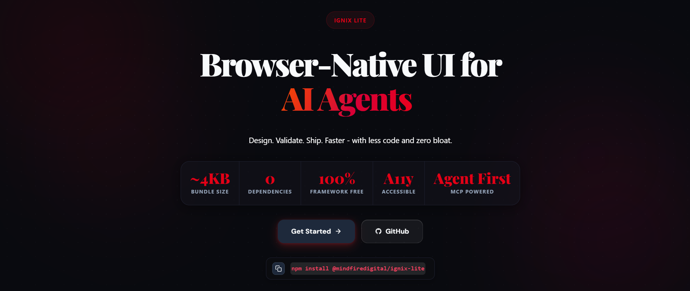

# Ignix-Lite




A lightweight, semantic, and browser-native UI system focused on simplicity, accessibility, and high performance. Powered by classless CSS and modern AI tooling.

[](https://www.npmjs.com/package/@mindfiredigital/ignix-lite)
[](LICENSE)
[](https://github.com/mindfiredigital/ignix-lite/actions)

---

## The Ignix-Lite Philosophy

Ignix-Lite is a **classless-first CSS UI framework** that styles semantic HTML elements out-of-the-box. Instead of bloating your HTML with dozens of utility classes, you write standard, semantic HTML tags, and Ignix-Lite styles them beautifully and automatically.

### Why Ignix-Lite?
* **Zero Class Bloat:** Write clean, standard HTML markup.
* **Accessibility First:** Strictly designed to meet WCAG 2.2 AA standards out-of-the-box.
* **AI-Agent Ready:** Includes a Model Context Protocol (MCP) server, CLI, and LLM Skills that allow AI agents to generate, validate, and preview accessibility-compliant markup instantly.

---

## Packages in this Monorepo

Ignix-Lite is designed as a modular monorepo containing the following packages:

| Package | Description | Version |
| :--- | :--- | :--- |
| [`@mindfiredigital/ignix-lite`](/packages/core) | **Core CSS Library** — The browser-native, classless, and themeable styles. | [](https://www.npmjs.com/package/@mindfiredigital/ignix-lite) |
| [`@mindfiredigital/ignix-lite-engine`](/packages/engine) | **Rules Engine** — Core validation, intent parsing, accessibility auditing, and vector search. | [](https://www.npmjs.com/package/@mindfiredigital/ignix-lite-engine) |
| [`@mindfiredigital/ignix-lite-cli`](/packages/cli) | **Developer CLI** — Scaffolding, editor setup, themes, and headless component previewing. | [](https://www.npmjs.com/package/@mindfiredigital/ignix-lite-cli) |
| [`@mindfiredigital/ignix-lite-mcp`](/packages/mcp) | **MCP Server** — Integrates Ignix-Lite with Claude Desktop, Gemini CLI, Cursor, and other AI systems. | [](https://www.npmjs.com/package/@mindfiredigital/ignix-lite-mcp) |
| [`@mindfiredigital/ignix-lite-skill`](/packages/skill) | **LLM Skill** — Prompts, intents, reference templates, and guidelines for AI code generation. | [](https://www.npmjs.com/package/@mindfiredigital/ignix-lite-skill) |

---

## Quick Start

### 1. Installation

Install the core styling library using npm or pnpm:

```bash
npm install @mindfiredigital/ignix-lite
```

### 2. Standard CSS Import

Import the minified stylesheet into your application's entry point:

```javascript
import '@mindfiredigital/ignix-lite/ignix-lite.min.css';
```

Or reference it directly from a CDN (e.g., in your HTML `<head>`):

```html
<link rel="stylesheet" href="https://cdn.jsdelivr.net/npm/@mindfiredigital/ignix-lite/ignix-lite.min.css" />
```

### 3. Usage Example

Write standard, semantic markup, and use `data-intent` to apply predefined semantic variations:

```html
<!-- Primary & Danger Buttons -->
<button data-intent="primary">Save Changes</button>
<button data-intent="danger">Delete Account</button>

<!-- Form Element styling is implicit and native -->
<input type="text" placeholder="Enter username..." />
```

---

## Component Registry

Ignix-Lite includes 28+ semantic, browser-native UI components:

| Category | Components |
| :--- | :--- |
| **Actions & Triggers** | Button, Dialog, Dropdown, Tabs, Tooltip |
| **Forms & Input** | Input, Checkbox, Radio, Select, Textarea, Form, Combobox |
| **Feedback & Status** | Alert, Badge, Progress, Meter, Skeleton, Toast |
| **Data & Content** | Table, Avatar, Card, Codeblock, Divider |

---

## AI-Driven Development (MCP & Skill)

Ignix-Lite is built for the era of AI coding assistants. Using our Model Context Protocol (MCP) server, LLM agents (like Claude or Gemini) can instantly design and validate interfaces for you.

To set up the MCP server inside your favorite agent client, run:
```bash
npm install -g @mindfiredigital/ignix-lite-cli
ignix-lite mcp setup claude        # Claude Desktop
ignix-lite mcp setup claude-code   # Claude Code CLI
ignix-lite mcp setup gemini        # Gemini CLI
ignix-lite mcp setup cursor        # Cursor Editor
```

---

## Local Monorepo Development

To set up and run Ignix-Lite locally:

### Prerequisites
* [Node.js](https://nodejs.org/) (v18+)
* [pnpm](https://pnpm.io/) (v9+)

### Installation
```bash
# Clone the repository
git clone https://github.com/mindfiredigital/ignix-lite.git
cd ignix-lite

# Install all monorepo dependencies
pnpm install
```

### Building Packages
```bash
# Compile core styles, components, integrations, and tools
pnpm build
```

### Verification & Validation
```bash
# Run the skill check and schema validator
node packages/skill/scripts/validate.js
```

---

## CI/CD & Release Workflow

Ignix-Lite uses:
- **Changesets** for automated package versioning and release management.
- **Automated Changelogs** generation for all modified packages.
- **GitHub Actions** for CI/CD checks, automatic testing, and publishing to npm.

---

## Contributing

Contributions are welcome. Please ensure:
- Semantic HTML usage.
- Strict accessibility (WCAG 2.2 AA) support.
- Consistent style patterns powered by design tokens.
- Proper test coverage and documentation updates.

---

## License

MIT License. Designed and maintained by [Mindfire Digital](https://www.mindfiredigital.com/).